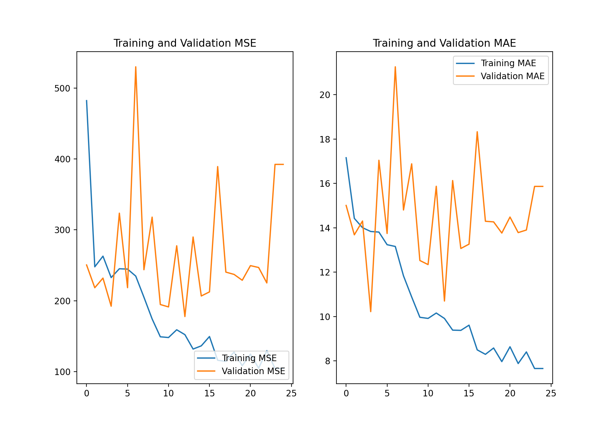
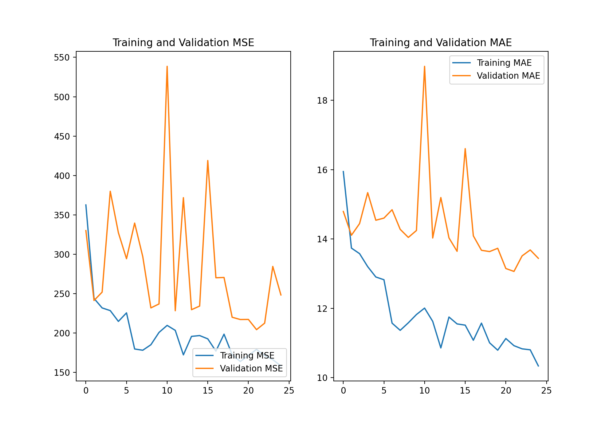

I experienced a number of difficulties with this project. The first one was trying to work within the limitations of my computer processing power. In order to train within a reasonable time frame (and without crashing PyCharm) I could only train the neural net with a max of 550 images. Additionally, before we were given hints on how to load the data, I struggled with keeping my labels and pictures in the same order. In my original file (which I abandoned after I decided to start again from scratch using the new hints we were given), I used glob.glob to get the files and Image.open to get the images. I then converted the images to an array. For whatever reason, this method would switch the order of my files so they were listed as “1.jpeg, 10.jpeg, 100.jpeg…” instead of “1.jpeg, 2.jpeg, 3.jpeg...” This was a fairly big problem, as the labels now wouldn’t match the images, but I managed to fix it using a bit of sorting code that I wrote:
```
train_files
train_labels_sorted=[]
for i in train_files:
    idx=int(i.split("/")[-1].split(".")[0])-1
    train_labels_sorted.append(train_labels[idx])

test_files
test_labels_sorted=[]
for i in test_files:
    idx=int(i.split("/")[-1].split(".")[0])-1
    test_labels_sorted.append(test_labels[idx])
```

To my knowledge, this worked fine, but I didn’t completely trust it, so when I got the hint, I used that instead. I started with a small DNN model, solely to test whether or not the data was loaded properly:
```
model = tf.keras.models.Sequential([
  tf.keras.layers.Flatten(),
  tf.keras.layers.Dense(32, activation='relu', input_shape=(480, 480, 3)),
  tf.keras.layers.Dense(64, activation='relu'),
  tf.keras.layers.Dense(1)
])
```

This worked well, but only as a confirmation that I had properly loaded the data. It did not work well as a model. So, I built a CNN. I chose a CNN so I could use convolutional layers (filters to highlight significant/helpful features in the image) and pooling (getting rid of the insignificant/unhelpful features in the image), which drastically improves computer vision and drastically improved my model. I found this specific scenario to be very interesting, as, to my knowledge, we haven’t used a CNN for regression problems yet. When we used CNNs in the past, they were solely for image classification. We have used a neural net for a regression problem, most notably the gas mileage problem, but we’ve never combined the two before now. My first CNN wasn’t terrible (but it wasn’t great either). I decided to start with 25 epochs, 300 of the training images, a RMSprop optimizer (after some small 5 epoch test comparisons with Adam), and the layers you see below (again, after some small 5 epoch tests in which I varied the number of layers and neurons):
```
model = tf.keras.models.Sequential([
    tf.keras.layers.Conv2D(64, (3,3), activation='relu',
                           input_shape=(480, 480, 3)),
    tf.keras.layers.MaxPooling2D(2, 2),
    tf.keras.layers.Conv2D(32, (3,3), activation='relu'),
    tf.keras.layers.MaxPooling2D(2,2),
    tf.keras.layers.Conv2D(32, (3,3), activation='relu'),
    tf.keras.layers.MaxPooling2D(2,2),
    tf.keras.layers.Flatten(),
    tf.keras.layers.Dense(32, activation='relu'),
    tf.keras.layers.Dense(64, activation='relu'),
    tf.keras.layers.Dense(1)
])
model.compile(optimizer=tf.keras.optimizers.RMSprop(0.001), loss='mse', metrics=['mae', 'mse'])
history=model.fit(train_imgs, train_labs, batch_size=20, steps_per_epoch=15, epochs=30, validation_split=.2)
```


As you can see in the above image, this model was extremely overfit. The training MSE and MAE were at 104.3 and 7.66, respectively. The validation MSE and MAE, however, were at 392.33 and 15.86, about four times the training MSE and two times the training MAE. Based on this knowledge, I added as many images as I could while still maintaining reasonable training times and memory usage.
```
model = tf.keras.models.Sequential([
    tf.keras.layers.Conv2D(64, (3,3), activation='relu',
                           input_shape=(480, 480, 3)),
    tf.keras.layers.MaxPooling2D(2, 2),
    tf.keras.layers.Conv2D(32, (3,3), activation='relu'),
    tf.keras.layers.MaxPooling2D(2,2),
    tf.keras.layers.Conv2D(32, (3,3), activation='relu'),
    tf.keras.layers.MaxPooling2D(2,2),
    tf.keras.layers.Flatten(),
    tf.keras.layers.Dense(32, activation='relu'),
    tf.keras.layers.Dense(64, activation='relu'),
    tf.keras.layers.Dense(1)
])
model.compile(optimizer=tf.keras.optimizers.RMSprop(0.001), loss='mse', metrics=['mae', 'mse'])
history2=model.fit(train_imgs2, train_labs2, batch_size=25, steps_per_epoch=18, epochs=25, validation_split=.2)
```

As you can see in the above image, with 550 training images my model managed to significantly lower the validation MSE and MAE, decreasing the overfitting by quite a bit. The new training MSE and MAE were 162.87 and 10.16, respectively. Although this was technically an increase in MSE and MAE, I believe it was worth the decrease in overfitting. The new validation MSE and MAE were now 248.28 and 13.44, respectively. The difference between training and validation MSE and MAE was now not as drastic. Although my model could certainly be improved, given my experience and knowledge, I am pretty satisfied with my progress and final result. 
