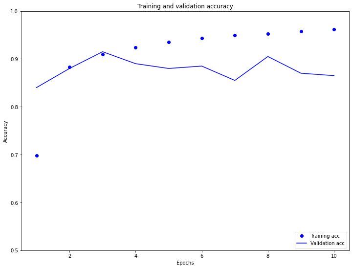

Responses for Day 4, July 9

1. Simply put, TF Hub is a cloud of TensorFlow machine learning modules. We used it to create our first layer (a Keras layer that embeds the sentences).
2. The optimizer function aims to minimize the loss value that you chose (in regards to type of loss value) and calculated using the loss function.
3. The training and validation loss compares the loss calculated for the data the model was built on versus the loss calculated for the data set aside from the model building process. The validation loss decreased at a faster rate than the training loss.

4. The training and validation accuracy compares the accuracy calculated for the data the model was built on versus the accuracy calculated for the data set aside from the model building process. This relationship usually is indicative of overfitting, or where the validation accuracy is fairly lower than the training accuracy. We see slight overfitting here.
