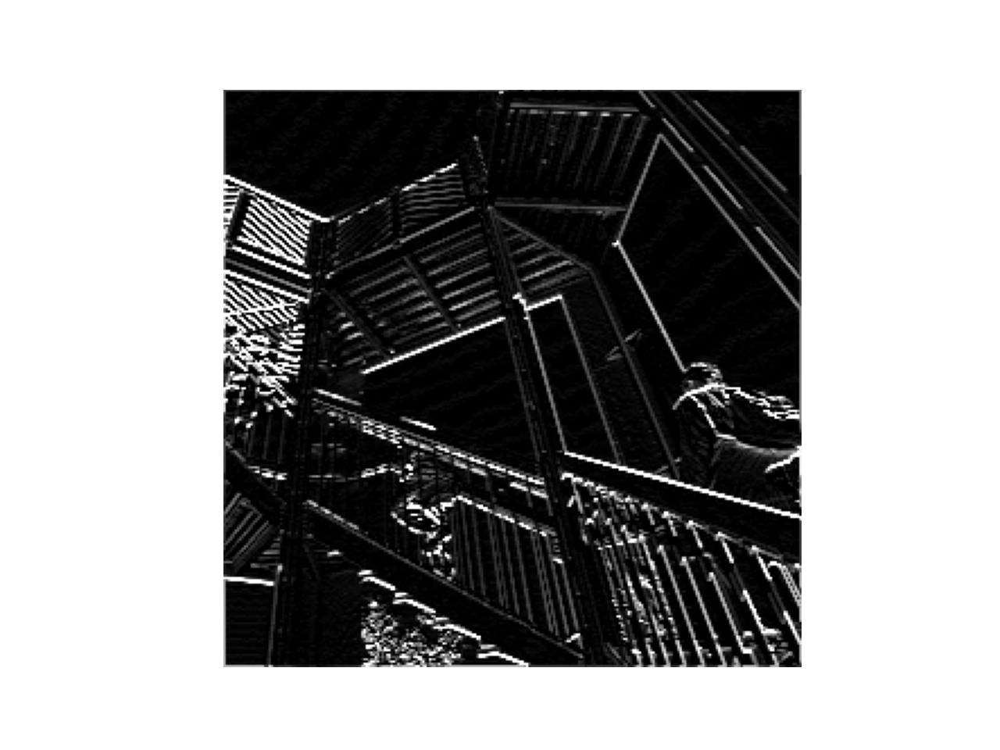

Responses for July 14

1.  Figure 1 shows the image after one application of my filter. It seems that the diagonal lines have been highlighted in the image, whereas everything else is sort of slightly muted.

Figure 2 shows the image after two applications. Now, a lot more lines are highlighted. Again, most are distinctly diagonal (45 degrees), but some newly highlighted lines are vertical and horizontal (or just slightly off of vertical and horizontal).

Figure 3 shows the image after three applications. Similar to the behavior observed in Figure 2, Figure 3 contains a laot of highlighted lines, including some wavy lines that are seemingly in the background. It looks like a cross between a sttic screen on a TV and Figure 1. With every application, the image size reduces by 2 pixels per dimension. For example, if the initial image size was 1080 x 1080, the filter would reduce the image size to 1078 x 1078. This happens because of the nature of filtering. When you apply a filter, you take one pixel and not only run it through the filter (which means changing its value using a weight multiplier), but every pixel around it. Consequently, the pixels that don't have a complete set of neighbors (the pixels on the edge) are simply removed from the image. This process of highlighting certain image characteristics (such as diagonal lines) can help neural networks recognize subjects of photographs (for instance, if the subject has distinct diagonal lines).

2. Figure 1 (Pooled) shows Figure 1 after one application of a pooling filter. The pooling filter takes a selection of 4 pixels and, in this case, removes all but the pixel of the highest value. The result is a smaller picture. This helps speed up the neural network's learning by potentially getting rid of useless or unhelpful information.

3. The DNN model was far inferior to the CNN model. The CNN model uses filtering and pooling to perform more accurately (by highlighting important features of an image) and more efficiently (pooling reduces image size while maintaining important features). Changing the 32s to 64 increased time and decreased accuracy. Additionally, adding more convolutional layers decreases accuracy and increases time. By adding more convolutional layers, you are overfitting the model so there is a substantial discrepency between the training and validation accuracies.
