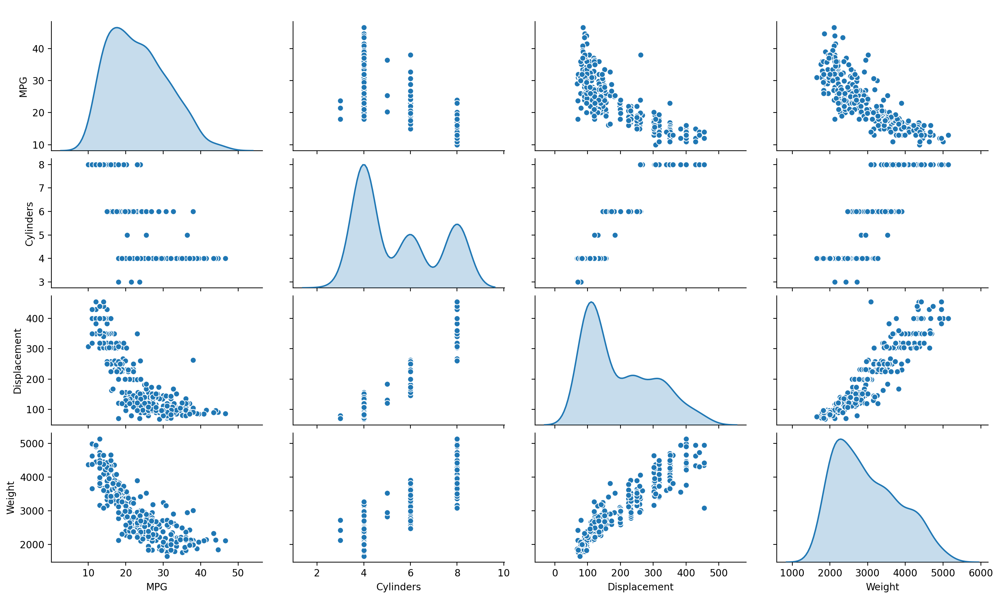
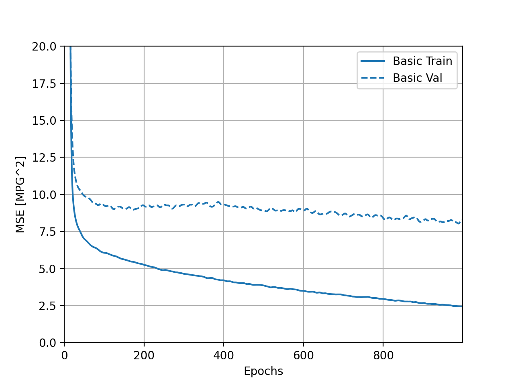

Response for July 15

A. 1. The ImageDataGenerator() command pulls images from a directory, auto-labels them using the name of the directory, and rescales or normalizes them. You use the argument "rescale" to normalize the images. To create a specific generator (i.e. train_generator vs. validation_generator), you need to specify the method (flow_from_directory), the directory you want to pull from (train_dir, in this case), the target size (what size you want all the images to be, since they may be different sizes), the batch size (how many images are pulled at a time), and the class mode (which depends on the number of labels you are using, which is two in the case of horses and humans).
A. 2. The CNN model has about 40 million parameters. It uses 3 convolutional layers and 3 max pooling layers. Originally, the images were 300 x 300 (from our target size specification), but when they were put through the first convolutional layer the size decreased to 298 x 298. This occurs because the filtering process doesn't work on pixels at the edges of the image, so they are removed. This happens every time the image is put through a convolutional layer. When the image is put through a pooling layer, the size halves for each dimension. So, the 298 x 298 size decreases to 149 x 149. Unlike the decrease in size due to the convolutional layer, this is a directly intended outcome. Max pooling takes a group of pixels (4 in this case) and chooses the one with the highest value. It deletes the rest. We used a sigmoid activation, which generates one output (a single scalar between 1 and 0), which indicates the probability that the image belongs to class 1. This activation is particularly helpful because we are dealing with only two labels. In the model compiler, we specified the loss function, the optimizer, and what metrics we want to keep track of.

B. 1. This plot helps show the relationship between certain variables in the data. For instance, there's a fairly distinct positive correlation between weight and displacement (of course, correlation does not prove causation, but it still helps hint at possible causational relationships). The diagonal represents something called the univariate distribution of each variable. Essentially, this is the probability distribution of one variable. So, when the plot axes are variable X by variable X, then the displayed plot shows the probability distribution of variable X.

B. 2. The training MSE, or mean squared error, actually increases during these last five epochs. The validation MSE decreases, which would normally be a fairly good sign, but the fairly significant discrepancy between the validation MSE and training MSE indicates that the model is very overfit and, therefore, won't handle potential new data well.
C. The 4 different sized models represented different models (with different amounts of convolutional layers) and how well they performed based on these differences. Notably, after 50 and 100 epochs the large model and the medium model, respectively, developed a huge discrepancy between validation and training losses. The tiny and small models seemed to do fairly well, with the tiny model producing the smallest discrepancy.
