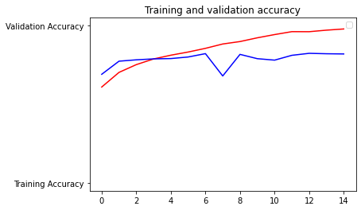

Responses for July 20

A. I plan on creating a neural network that can guess a book's genre solely by the book's cover (thus disproving the age old saying "you can't judge a book by its cover"). 

C.

D. 1. We used RMSprop (or root mean squared prop) in this lab and, in the article "Understanding RMSprop," we find that RMSprop can work much better (at reducing the loss function) than competing optimizers such as NAG, SGD, and Momentum.

D. 2. In the lab our loss function was binary cross entropy. With binary cross entropy, the loss is calculated by taking the negative log of the probabilities, so you have high losses for low probabilities (or confidence levels, I suppose) and low losses for high probabilities. Then, to calculate the binary cross entropy, you take the mean of these losses.

D. 3. Metrics just allow you to evaluate your model. In this lab we kept track of the accuracy, so we could tell how accurate the model was.

D. 4. Based on the graphs above, the model was doing alright until about epoch 7. Validation losses and accuracies are in blue, whereas training losses and accuracies are in red. You can see that the validation accuracy dipped at epoch 7 and never really caught up to the training accuracy. The discrepancy we see between the final validation accuracy and the final training accuracy is indicative of overfitting, which essentially means the model probably won't perform well with new data.

(This last one is solely for my own amusement)

D. 5. The results are in the same order as the pictures:
1. "dog1.jpeg is a dog"
2. "dog2.jpg is a dog"
3. "dog3.jpeg is a dog"
4. "cat1.jpg is a cat"
5. "cat2.jpg is a cat"
6. "cat3.jpg is a dog"
7. "cat4.jpg is a dog"

It got two wrong, but, to be fair, one wasn't actually a cat, but a CGI cat/person from the movie Cats, although I really did think it would have gotten that right, given the similar features. The model performed pretty well (5/6 correct). I suppose a good way to improve the model would be to force the model to focus on specific features, like whiskers, for instance.
