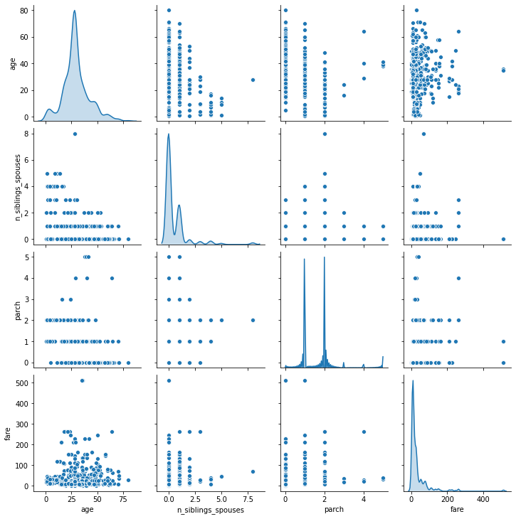
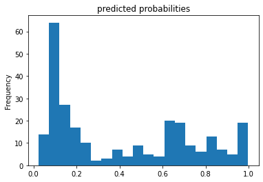
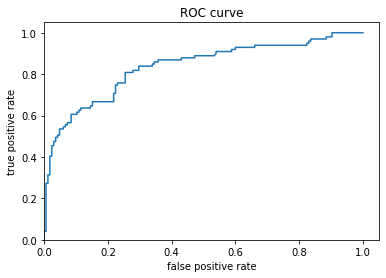

Response for July 21

A. 1. We split the labels from the data by using .pop. The names of the labels datasets are train_y and test_y.

2.1 
```
classifier=tf.estimator.DNNClassifier(
    hidden_units, feature_columns, model_dir=None, n_classes=2, weight_column=None,
    label_vocabulary=None, optimizer='Adagrad', activation_fn=tf.nn.relu,
    dropout=None, config=None, warm_start_from=None,
    loss_reduction=losses_utils.ReductionV2.SUM_OVER_BATCH_SIZE, batch_norm=False
)
```
   2.2 
```
regressor=tf.estimator.LinearRegressor(
    feature_columns, model_dir=None, label_dimension=1, weight_column=None,
    optimizer='Ftrl', config=None, warm_start_from=None,
    loss_reduction=losses_utils.ReductionV2.SUM_OVER_BATCH_SIZE,
    sparse_combiner='sum'
)
```
   2.3 
```  
classifier=tf.estimator.DNNLinearCombinedClassifier(
    model_dir=None, linear_feature_columns=None, linear_optimizer='Ftrl',
    dnn_feature_columns=None, dnn_optimizer='Adagrad', dnn_hidden_units=None,
    dnn_activation_fn=tf.nn.relu, dnn_dropout=None, n_classes=2, weight_column=None,
    label_vocabulary=None, config=None, warm_start_from=None,
    loss_reduction=losses_utils.ReductionV2.SUM_OVER_BATCH_SIZE, batch_norm=False,
    linear_sparse_combiner='sum'
)
```
   2.4 
```
regressor=tf.estimator.DNNLinearCombinedRegressor(
    model_dir=None, linear_feature_columns=None, linear_optimizer='Ftrl',
    dnn_feature_columns=None, dnn_optimizer='Adagrad', dnn_hidden_units=None,
    dnn_activation_fn=tf.nn.relu, dnn_dropout=None, label_dimension=1,
    weight_column=None, config=None, warm_start_from=None,
    loss_reduction=losses_utils.ReductionV2.SUM_OVER_BATCH_SIZE, batch_norm=False,
    linear_sparse_combiner='sum'
)
```
   2.5 
```
classifier=tf.estimator.LinearClassifier(
    feature_columns, model_dir=None, n_classes=2, weight_column=None,
    label_vocabulary=None, optimizer='Ftrl', config=None, warm_start_from=None,
    loss_reduction=losses_utils.ReductionV2.SUM_OVER_BATCH_SIZE,
    sparse_combiner='sum'
)
``` 
A. 3. The input function determines how data is converted to a Tensorflow dataset. The feature columns describe how the model should use the input data.

A. 4. The classifier.train() command trains the classifier model. It takes the input function we made earlier and the steps argument (which basically specifies the number of training steps) to do so. The classifier is our DNNClassifier that uses the feature columns we defined.

A. 5. The DNNClassifier got an accuracy of .9 for the test set (second best). The DNNLinearCombinedClassifier (when I specified dnn_feature_columns and dnn_hidden_units) got .867 test accuracy (third best). Finally, the LinearClassifier got .967, making it the most accurate, which I found to be surprising.




B. 1. These two plots above demonstrate essentially the same thing, which is the age distribution of the Titanic dataset. From the plots, it is clear that the majority of passengers were in their mid to late 20's. Additionally, most of the passengers were below the age of 50, even 40. The data seems skewed to the right.

B. 2. A categorical column is a column describing a category (e.g. sex, class, etc.) rather than an actual numerical value (e.g. weight, age, etc.), but the category placement is described by a numerical value (e.g. the sex category could be split into male=0 and female=1). A dense feature, comparatively, is an actual numerical value, such as age or weight.

B. 3. The feature columns were both categorical and dense columns. The categorical column would have the category as a key and the unique category values in a list corresponding to said key. For example, the key "sex" would correspond with the list ("male", "female"). The cross featured column age_x_gender could potentially help the model, as considering and weighting age and gender together could be a stronger indication of survivability than the two separated. Originally, without the cross featured column, the model achieved an accuracy value of .754, whereas the model with the cross featured column actually did worse, achieving an accuracy value of .720. 




The predicted probabilities histogram illustrates the distribution of predicted chances of survival, with the majority of estimations, unfortunately, below a .5 (50%) survival rate. It seems that the model didn't predict a 0% survival rate for anyone. Moving on to the ROC curve, we see the false positive estimations versus the true positive estimations (a positive estimation is equivalent to a passenger surviving). It seems that the rate of false positives increased at a higher rate than the rate of true positives. This is indicative of a fairly poor model.
