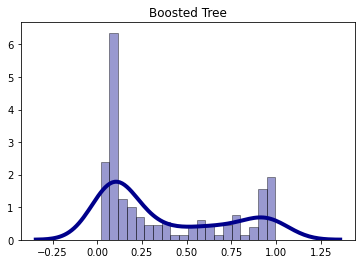

Response for July 22

A. 1. One hot encoding (or a one hot encoded column) is a collection of 1s and 0s corresponding to a category. For instance, the category "sex" is split into two columns: "male" and "female." A male observation would have a 1 in the male column and a 0 in the female column. The source values are discrete.

A. 2. A dense feature illustrates complete and incomplete data points. Unknown values are given a value of 0. This helps the model move past tricky unknown values that could potentially mess up the training process.

A. 3. (B=Boosted Tree, L=Logistic Regression) They're mostly the same until around .9. Noticeably, the logistic regression doesn't give a probability above around .9, whereas the boosted tree does.

The ROC indicates that the model isn't terrible. The ROC of a perfect model would basically match the left and top lines of the graph, which means that the true positive rate increases without any increase in false positive rate (a vertical line starting at 0,0), until it gets to y=1, then the graph goes all the way to the right (a horizontal line starting at 0,1 and ending at 1,1). The ROC curve we see here is fairly similar to the perfect graph I described, but, ultimately, it's not good enough. The AUC also indicates model performance, as perfect model performance would achieve the largest AUC, so the bigger the AUC the better the graph.

B. 1. According to the plots, the best contributing features to predicted survival probability are age and sex. Unfortunately for passenger 130, it seems he had hardly anything that helped his chances of survival.

B. 2. According to the permutation and gain feature importance plots, sex was far and away the most important feature towards determining survival rates. This is interesting to me, as I initially believed the determining factor would actually be class, since I faintly remember learning about the extra difficulties those of lower classes had to face in comparison to the members of the upper class. I believe it had something to do with the part of the boat they were on, perhaps that they were on a lower portion of the boat.
