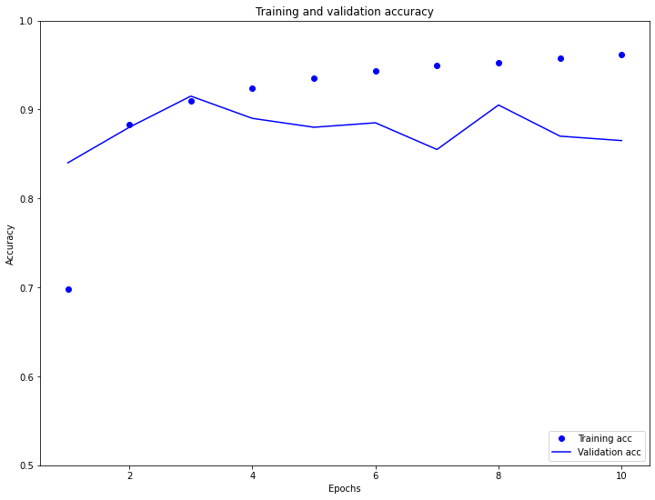
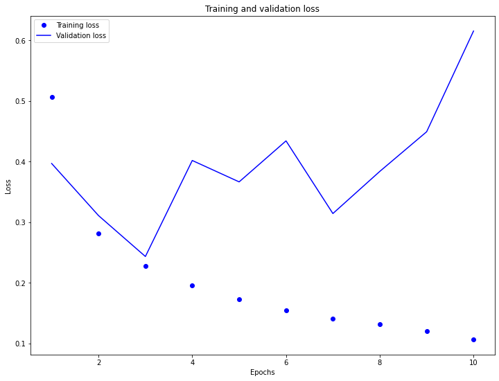

Response for July 28

C. 1. In the video, we saw how word embeddings are given positive and negative values (such as male;gender=-1 and female;gender=1 or king;gender=-.95 and queen;gender=.97). This is different than one hot encoding as that one hot encoding creates a new column for each category ("male", "female") and assigns a 1 to true instances (observation is a male/female) and a 0 to false instances (observation is not male/female). Word embedding avoids this by keeping a broader version of the category (instead of "male" and "female" it's now "gender") and assigns different values between -1 and 1. This way it avoids oversizing the data features (instead of 2 categories for gender, word embeddings use one row for the word column).

C. 2.

As you can see in the plots above, the validation loss really begins to increase (as the training loss begins to decrease) at about 3 epochs. Similarly, the validation accuracy decreases away from the increasing training accuracy at 3 epochs. This is a sign of overfitting, or where the model performs well on training data, but not as well on new data. Notably, the model starts out underfit, which is indicated by the training accuracy being much lower than the simultaneous validation accuracy.

D. 1.

Above are the plots for the first model, without the LSTM layers. As you can see, after the first epoch the validation accuracy began to decrease away from the increasing training accuracy, which is a clear sign of overfitting. Another indicator, as mentioned before, is when the validation loss increases away from the training loss, as we see here.

Above are the plots for the model with the LSTM layers. I decided to use 2 LSTM layers. Strangely, it seems that the addition of these layers didn't, in fact, help the model. The validation accuracy seems very slightly lower and the validation loss seems slightly higher than the previous model's. Again, the model seems overfit, due to the discrepancy between validation and training both accuracy and loss values.
