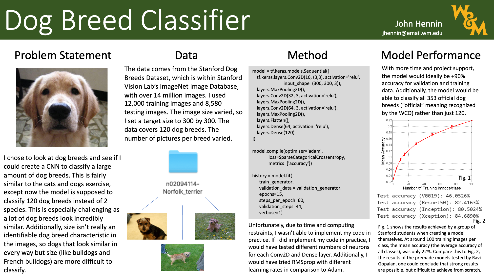
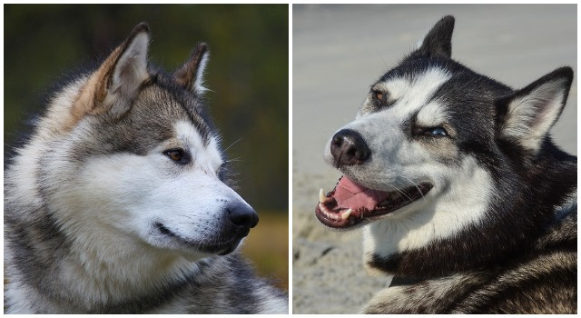
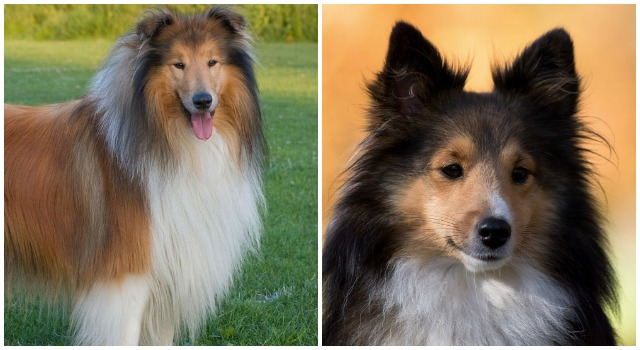
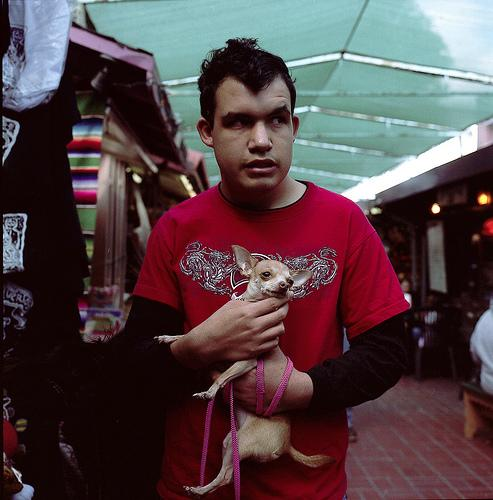
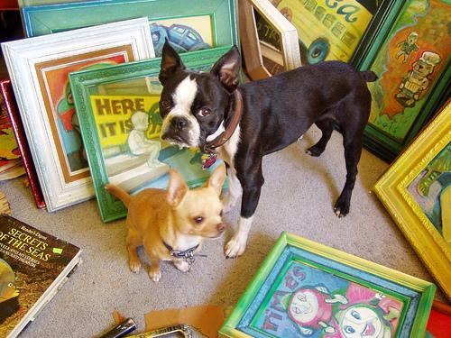

This problem is important specifically for veternarians and pound employees, as they have to identify different dog breeds, which sometimes is fairly difficult, as a lot of dogs look very similar. Additionally, in an advanced version, this model could predict dog geneaology for mixed-breeds, which I'll further discuss in the final paragraph of this write-up. Unfortunately, as I'm using a CNN to solve this issue, there are certain inherent obstacles regarding the nature of CNNs, or at least with my limited knowledge of them. Specifically, there are certain dog breeds that look incredibly similar and really only differ in size (e.g. see Alaskan Malamutes versus Siberian Huskies and Collie versus Sheepdog pictures above). Size is an incredibly hard feature to derive from an image, especially with no constant reference.

I used data from the Stanford Dog Breeds Dataset and used 12,000 training images and 8,580 testing images. The data was, in some instances, a bit problematic (see images from the Chihuaha dataset above). In the first image, we see a man holding a dog. This is really only an issue as he's covering the dog a bit, which could hide certain features. The second picture, however, is much worse, as, in addition to the Chihuahua, there's also a Boston Terrier, which certainly could throw the CNN off, since it could accidentally identify features on the Boston Terrier instead of the Chihuahua.

Unfortunately, I wasn't able to execute the code myself (both in regards to time and especially to computing power) but, had I done so, I would have compared certain characteristics of my model to best optimize its performance. For instance, I would have compared different optimizers (specifically Adam versus RMSprop at different learning rates), compared number of layers, compared number of neurons per layer, etc. I probably would have kept ReLU activation for my Conv2D and Dense layers, as well as 120 neurons for my output, since the model is predicting 120 different classes. The steps per epoch for both training and validation were calculated by dividing the images by the batch size. So, 12,000 images at a batch size of 200 led me to 60 steps for the training data and 8,580 images at a batch size of 195 led me to 44 steps for the testing data.

As I wasn't able to execute the code myself, I pulled results from two very similar projects. The first comes from a group of Stanford students, whose graph you can find in the poster labeled as Fig. 1. As you can see, they were only able to achieve about .22 testing accuracy with 100 images per class. Since the average images per class was around 150, this means that 2/3rds of the data was used in this training set. I then compared this to a more sophisticated study (Fig. 2 in poster), in which Ravi Gopalan, a data scientist in Singapore, achieved a maximum testing accuracy of about .85 solely using a premade model. He then adjusted a few settings (learning rate, normalization, etc.) and improved this score to almost .9.

With more time and resources, I would like to, most importantly, perfect or come close to perfecting the current model, with the sole intent of identifying dog breeds. This means that the training accuracy would be about the same as the validation accuracy (and they would both be incredibly high at around .95). I would also like to test this perfect model on pictures of my dogs and my friends' dogs. Additionally, the model would be able to predict all dog breeds, which would mean collecting much more data, which (at an average of 150 images for 233 more breeds, since the total is 353 and the model only covers 120 currently) would be just short of 35,000 new images. In order to improve model usage or, in other words, the capacity of the model for application, I would like to work out a partial breed identification function, where the model would provide certain confidence values that an image is a number of breeds. So, a mixed-breed dog would be assigned a confidence value of .3 that a dog is Breed A, .5 that a dog is Breed B, and .2 that a dog is Breed C, which would correspond to the dog's genealogy (so the dog is not 50% likely to be Breed B, but quite literally 50% of the dog's genealogy is Breed B).
