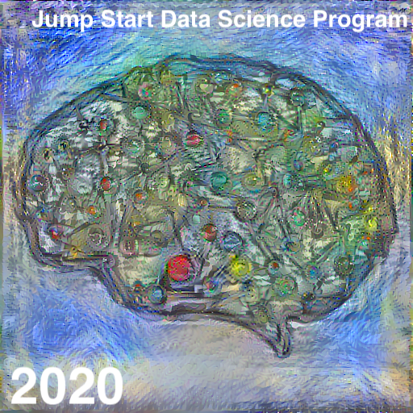
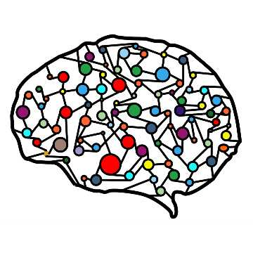

The content image (shown below) is a visualization of a neural network mapped onto the human brain. I chose this image to represent the extraordinary and quite groundbreaking nature of machine learning (a huge step towards emulating human learning). I chose Van Gogh's Starry Night (also shown below) for the style image, since the soft and subtle (almost vibration-like) patterns remind me of the subtle internal activity of brains and neural networks. Consequently, I thought it would be a nice fit.

